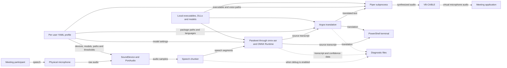
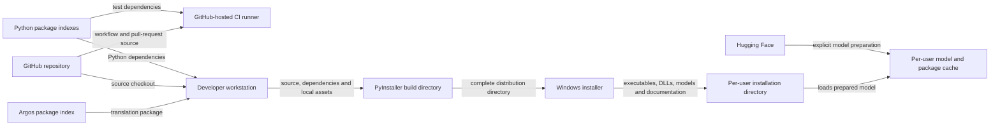

# Live Translator Threat Model

This document identifies security threats affecting the Parakeet-based Live
Translator architecture and provides the basis for the project risk register
and security remediation priorities.

## Document status

| Field | Value |
| --- | --- |
| Status | Revalidated for baseline `79f95d6` |
| Security owner | Kristupas |
| Architecture baseline | Parakeet PR #2 plus merged security PRs #3, #4 and #5 and reliability PR #6 |
| Baseline commit | `79f95d6` |
| Component inventory | `docs/component-inventory.md` |
| Last updated | 2026-09-02 |
| Stakeholder review | Pending project-lead review |

## Purpose

The purpose of this threat model is to identify how confidential meeting data,
application components and release artifacts could be exposed, modified,
misused or made unavailable.

The analysis must preserve the following project requirements:

- Speech recognition, translation and speech synthesis run locally.
- Meeting mode works without Internet access after explicit preparation.
- Security controls do not introduce unacceptable translation latency.
- Windows 10 and Windows 11 remain supported.
- Live Translator remains installable per user without administrator
  privileges.
- VB-CABLE may be provisioned separately by IT because driver installation
  requires administrator privileges.
- Diagnostic and benchmark capabilities remain available in a controlled form.

## In scope

- Live Translator CLI and configuration.
- Microphone capture and speech chunking.
- Parakeet and ONNX speech recognition.
- Argos machine translation.
- Piper speech synthesis.
- VB-CABLE audio routing.
- Diagnostic and calibration artifacts.
- Python dependencies and third-party model assets.
- PyInstaller application packaging.
- Windows installer and per-user installation.
- GitHub Actions CI workflow.

## Out of scope

- Security of Microsoft Teams itself.
- Security of the Windows operating system outside settings directly required
  by Live Translator.
- Physical attacks against the workstation.
- Organization-wide identity and endpoint-management controls.
- VB-CABLE driver development and source-code security.

External components remain relevant as trust dependencies even when their
internal implementation is outside the project scope.

## Security objectives

1. Confidential meeting audio, transcripts and translations are not disclosed
   to unauthorized parties.
2. Only approved application code, executables, libraries and models are
   loaded or executed.
3. Audio, transcripts and translations cannot be modified without detection
   in ways that produce misleading meeting output.
4. Meeting mode remains available and does not fail because of unbounded
   resource use or uncontrolled subprocess execution.
5. Meeting mode does not make unexpected network connections.
6. Diagnostic information is collected only when explicitly enabled and is
   retained according to an approved policy.
7. Build and release artifacts can be traced to approved source code and
   verified before installation.

## Protected assets

| ID | Asset | Why it must be protected |
| --- | --- | --- |
| AST-01 | Raw meeting audio | May contain confidential or personal information before transcription. |
| AST-02 | Source transcripts | Contain the spoken content of the meeting in text form. |
| AST-03 | Translations | May expose meeting meaning and may influence actions taken by participants. |
| AST-04 | Synthesized translated audio | Carries confidential translated content into the meeting application. |
| AST-05 | Runtime executables and DLLs | A modified executable or library could run attacker-controlled code. |
| AST-06 | ASR, translation and TTS models | Modified models could execute native-parser attacks or manipulate output. |
| AST-07 | Profiles and configuration | Control trusted paths, models, devices, thresholds and diagnostic outputs. |
| AST-08 | Diagnostic and calibration artifacts | May contain audio, transcripts, paths, device information and model results. |
| AST-09 | Build and installer artifacts | Must represent approved source and dependencies without unauthorized changes. |
| AST-10 | CI workflow and dependencies | Can execute repository and third-party code during automated testing. |
| AST-11 | Offline-operation assurance and network metadata | The application must not make unexpected network requests during meetings or expose avoidable usage metadata. |

## Runtime data flow

The solid arrows show the normal meeting-data path. Dotted arrows represent
optional diagnostic persistence that occurs only when diagnostic functionality
is explicitly enabled.

The normal meeting path processes audio and text locally. However, source
transcripts and translations are printed to the terminal, and diagnostic mode
can persist raw audio and text to user-selected filesystem locations.

## Preparation and release data flow

This flow is separate from normal meeting processing. It shows where external
software and model assets enter the trusted application environment. Assets
downloaded or prepared here may later be parsed or executed during an offline
meeting.

## Trust boundaries

| ID | Trust boundary | Data crossing the boundary | Why the boundary matters |
| --- | --- | --- | --- |
| TB-01 | Meeting environment to Live Translator | Raw microphone audio | Audio may be confidential, malformed, unexpectedly long or captured from the wrong device. |
| TB-02 | Python application to native inference libraries and models | Audio tensors, model files, tokens and inference results | ONNX Runtime, CTranslate2 and SentencePiece process complex external assets using native code. |
| TB-03 | Live Translator process to Piper subprocess | Translated text, executable and model paths, temporary WAV data | The application starts a separate executable with the current user's permissions. |
| TB-04 | Application memory to local filesystem | Profiles, model caches, temporary WAV files, diagnostic audio, transcripts and translations | Persisted data can outlive the meeting and may be accessible to other software running as the same user. |
| TB-05 | Live Translator to Windows audio system and VB-CABLE | Raw microphone input, synthesized audio and device identifiers | Device-selection mistakes or access by other local audio applications may disclose or misroute meeting audio. |
| TB-06 | Local environment to external package and model services | Dependency names, model identifiers, downloaded packages and model files | External assets enter the trusted runtime and are not currently verified against an application-approved integrity manifest. |
| TB-07 | Repository and pull requests to GitHub Actions runners | Source code, test code, workflow instructions, dependencies and token permissions | Pull-request and third-party action code executes automatically in CI. |
| TB-08 | Developer workstation to release artifact | Local source, dependencies, models, executables, DLLs and documentation | Unexpected or modified local files can be included in the PyInstaller application and Windows installer. |
| TB-09 | Installer to per-user installation directory | Application executable, libraries, models and configuration examples | The directory is writable by the same Windows user and installed artifacts are not currently verified at runtime. |

## Data-storage locations

| Location | Data stored | Expected lifetime | Current concern |
| --- | --- | --- | --- |
| Process memory | Raw audio, transcripts, translations, model tensors and synthesized samples | During application execution | No explicit sensitive-memory clearing; availability depends on bounded processing and queue behaviour. |
| PowerShell terminal | Content-free progress by default; transcripts/translations only with `--show-text`; errors and selected local paths | Depends on terminal and host logging configuration | Explicitly displayed text may remain visible or be captured by external terminal logging. |
| Per-user or explicitly selected diagnostics directory | Raw audio chunks, transcripts, translations and audio settings | Default maximum 7 days or 500 MB, configurable; purge available | Plaintext storage inherits filesystem permissions; approved ACL, encryption, backup/sync and custom-path policy remain undefined. |
| Temporary directory | Piper-generated WAV files | Normally until synthesis completes | Abnormal termination may leave recoverable plaintext audio. |
| Prepared Parakeet directory and Hugging Face metadata | Pinned Parakeet model files, revision stamp and retrieval metadata | Persistent until manually removed | Repository/revision and required presence are controlled, but model bytes are not verified by an application-approved SHA-256 manifest. |
| Argos package directories | Translation models and metadata | Persistent until manually removed | Package source, version and integrity are not application-approved. |
| Per-user profile directory | YAML configuration and trusted-path selections | Persistent across application reinstall | User-writable configuration controls security-sensitive paths and settings. |
| Application installation directory | EXE, DLLs, Piper, models and documentation | Until update or uninstall | Runtime lookup is root-restricted, but same-user content modification is possible and no SHA-256 manifest verification exists. |
| GitHub Actions logs and cache | Test output, dependency data and runner metadata | Controlled by repository settings | Actual retention and token defaults require repository-settings review. |

## Threat actors and failure sources

A threat does not always require a deliberate external attacker. Accidental
misconfiguration, compromised dependencies and local malware can produce the
same security impact.

| ID | Threat actor or failure source | Relevant capability | Explicit limitation |
| --- | --- | --- | --- |
| TA-01 | Authorized but inexperienced user | Can run CLI commands, select profiles, devices and diagnostic output paths, and install the application for their account. | Does not intentionally attempt to compromise the application. |
| TA-02 | Malicious process running as the same Windows user | Can read or modify user-writable profiles, application files, caches and diagnostic artifacts and may access permitted audio devices. | Does not initially have administrator or kernel privileges. |
| TA-03 | Malicious or untrusted meeting participant | Can provide spoken audio designed to cause incorrect transcription, excessive processing or misleading translation. | Cannot directly modify local files or configuration through meeting audio alone. |
| TA-04 | Compromised package, model or binary supplier | Can distribute a malicious or vulnerable Python package, model, executable, DLL or archive through a trusted-looking source. | Must reach the workstation through preparation, dependency installation or release inputs. |
| TA-05 | Malicious or compromised project contributor | Can submit repository code, tests or workflow changes through a branch or pull request. | Repository permissions, review rules and GitHub settings may restrict merging or access to secrets. |
| TA-06 | Network attacker during preparation | Can attempt to interfere with package or model retrieval or redirect users to unapproved sources. | HTTPS provides transport protection, but it does not establish application-level approval of a specific artifact version or hash. |
| TA-07 | Accidental build or release contamination | Local debug files, documentation, stale binaries or modified assets can unintentionally enter a release. | Does not require malicious intent. |
| TA-08 | Resource exhaustion or component failure | Long audio, extreme settings, malformed models, blocked subprocesses or queue pressure can consume time, memory, CPU or disk. | May be accidental or deliberately triggered. |

A complete compromise of the Windows administrator account, kernel or physical
workstation is outside the practical protection boundary of this application.
However, the project must not require unnecessary administrator privileges and
must document privileged prerequisites such as VB-CABLE installation.

## Security assumptions

The following assumptions must be confirmed before approving confidential
internal use:

- The workstation is organization-managed and receives supported Windows
  security updates.
- The Windows user account is not shared between unrelated users.
- Endpoint protection and standard Windows access controls are enabled.
- VB-CABLE is installed by IT from an approved source and its driver signature
  and version are verified.
- Internet access is permitted only during explicit preparation and software
  update activities.
- Required models and translation packages are prepared before an offline
  meeting.
- Normal meeting mode is expected to operate without Internet access.
- Users understand that terminal output may contain confidential transcripts
  and translations.
- Diagnostic capture is disabled during normal meetings unless explicitly
  authorized.
- GitHub branch protection, pull-request review and workflow permissions are
  configured outside the repository and must be reviewed separately.
- Security controls must preserve acceptable translation latency and the
  per-user application installation model.

If an assumption is false, the affected risk must be reassessed rather than
silently treating the assumption as a security control.

## Entry points

| ID | Entry point | Controlled by | Security-relevant input |
| --- | --- | --- | --- |
| EP-01 | CLI arguments | Local user or launcher shortcut | Commands, profiles, file paths, model identifiers, executable paths, device names and numeric limits. |
| EP-02 | YAML profile | Local user or software modifying the profile | Runtime paths, languages, devices, model selection, thresholds and queue settings. |
| EP-03 | Physical microphone | User and meeting environment | Raw audio, silence, noise and potentially adversarial speech. |
| EP-04 | Local model and runtime directories | Installer, developer, local user or same-user process | Executables, DLLs, ONNX models, translation packages, voice models and metadata. |
| EP-05 | Environment variables and current working directory | Local user, launcher or parent process | Runtime search locations, package directories and executable resolution context. |
| EP-06 | Hugging Face model retrieval | Model identifier, dependency code and remote repository | Model configuration, ONNX files and repository metadata. |
| EP-07 | Argos package installation | CLI command, package index and downloaded archive | Translation models, tokenizer files and package metadata. |
| EP-08 | Python dependency installation | Project metadata, pip and package indexes | Python code, native extensions, build dependencies and package metadata. |
| EP-09 | Diagnostic output path | Local user | Destination for raw audio, transcripts, translations and diagnostic metadata. |
| EP-10 | GitHub pull request and workflow | Contributor and repository configuration | Source code, tests, action references and workflow commands. |
| EP-11 | PyInstaller build input | Developer workstation and local filesystem | Source, dependencies, models, binaries, documentation and unexpected local files. |
| EP-12 | Windows installer | Release process and distribution channel | Application executable, DLLs, models, documentation and installer metadata. |

## Existing security controls

The current application already contains several useful controls. These reduce
risk but do not remove the need for the planned security work.

| Control | Current protection | Limitation |
| --- | --- | --- |
| Explicit online preparation and offline Parakeet loading | `prepare-models` is the only application path that downloads the approved Parakeet repository/revision. Meeting mode verifies an existing directory and uses the supported offline resolver path. | Revision stamping and required-file checks do not prove SHA-256 content integrity; controlled release-level network monitoring is still required. |
| `yaml.safe_load` and configuration validation | Prevents unsafe YAML object construction, rejects unknown fields and validates types plus selected ranges. | Profile-name containment, complete upper bounds, atomic writes and configuration integrity remain incomplete. |
| Trusted runtime roots and shell-free Piper execution | Removes current-working-directory and `PATH` trust, rejects traversal/outside-root paths and avoids a command shell. | An approved directory can still contain a modified EXE, DLL or model until an integrity manifest is enforced. |
| Bounded realtime queues | Limits accumulation of recognition and playback work. | Other operations, subprocess execution and model loading still lack complete resource limits. |
| Piper timeout and UTF-8 stdin | Bounds a blocked Piper subprocess and removes Windows ANSI-codepage dependence for translated text. | Native model loading and other resource-intensive work remain only partly bounded. |
| Privacy-safe meeting defaults | Normal meeting mode creates no diagnostic artifacts and prints no transcript/translation. `--show-text` and diagnostic capture are separate explicit choices. | Authorized users can still expose or retain content deliberately, and external terminal/screen-capture controls are outside the application. |
| Diagnostic retention, purge and path containment | Uses a per-user default root, warnings, age/size cleanup, explicit purge and resolved-path checks against traversal, symlinks and junctions. | Captured content is plaintext; stakeholder-approved ACL, synchronization, encryption and audio-vs-text policy are not final. |
| Temporary WAV cleanup in `finally` | Removes normal Piper temporary output after processing. | Abnormal process termination or filesystem behaviour may leave recoverable data. |
| Per-user application installation | Avoids unnecessary administrator privileges for Live Translator itself. | The installation directory is writable by the same user, and VB-CABLE still requires privileged provisioning. |
| Unit-test and CI matrix | Baseline `79f95d6` passes 336 local tests (3 symlink tests skipped without Windows symlink privileges), including offline, trusted-root, diagnostics, terminal-privacy and Piper regression coverage. | Many tests still mock models/audio and do not replace controlled network, device, installer and release validation. |
| `.gitignore` rules | Reduce accidental inclusion of common audio, calibration and debug artifacts in Git. | Ignore rules are not access control and do not cover every custom path or build input. |

## Threat classification method

Threat scenarios will be grouped using the STRIDE model:

| Category | Question asked in this project |
| --- | --- |
| Spoofing | Can an unapproved executable, model, device or package be accepted as trusted? |
| Tampering | Can audio, configuration, models, code or release artifacts be modified without detection? |
| Repudiation | Can security-sensitive preparation or release actions occur without sufficient traceability? |
| Information disclosure | Can meeting audio, transcripts, translations, paths or diagnostics reach an unauthorized party? |
| Denial of service | Can audio, configuration, models, subprocesses or queues make translation unavailable or excessively delayed? |
| Elevation of privilege | Can application-controlled paths or dependencies cause unintended code execution with the user's or greater privileges? |

STRIDE is used to discover threats. Risk priority will be determined separately
from likelihood and impact; the number of STRIDE categories does not determine
risk severity.

## Threat scenarios

The scenarios below describe plausible ways in which the identified assets
could be compromised. They are not automatically confirmed vulnerabilities and
have not yet been assigned final risk priorities.

| ID | STRIDE | Threat scenario | Affected assets | Entry point or boundary | Existing control and remaining gap |
| --- | --- | --- | --- | --- | --- |
| THR-01 | Spoofing, Tampering, Elevation of privilege | A malicious or replaced Piper executable or companion DLL inside an otherwise approved runtime location is launched with the current user's permissions. | AST-03, AST-04, AST-05, AST-09 | EP-02, EP-04, EP-05; TB-03, TB-09 | Current-working-directory, `PATH`, traversal and outside-root loading are rejected and Piper uses no command shell. Approved SHA-256 values and protected manifest/signature verification are not yet enforced. |
| THR-02 | Spoofing, Tampering, Denial of service | A modified, malicious or incompatible ASR, translation or TTS model is accepted and produces manipulated output, targets a native parser or consumes excessive resources. | AST-01, AST-02, AST-03, AST-05, AST-06 | EP-02, EP-04, EP-06, EP-07; TB-02, TB-06 | The default ASR repository/revision is pinned, meetings require prepared local assets and sensitive lookup uses trusted roots. SHA-256 verification is still absent for ASR, Argos and TTS model bytes. |
| THR-03 | Tampering, Elevation of privilege | A compromised or unexpectedly changed Python dependency or native wheel is installed and executes malicious code during development, CI, build or application runtime. | AST-05, AST-09, AST-10 | EP-08, EP-10, EP-11; TB-06, TB-07, TB-08 | Dependency versions are constrained to ranges, but there is no complete lock file, hash verification, SBOM or automated vulnerability gate. |
| THR-04 | Tampering, Elevation of privilege | A crafted Argos package archive writes files outside the intended package directory or installs unapproved model content during the explicit `argos-install` workflow. | AST-05, AST-06, AST-07 | EP-07; TB-04, TB-06 | Package installation is an explicit preparation action. The inspected workflow does not enforce an application-approved package version, archive hash, signature or explicit extraction-path containment. |
| THR-05 | Information disclosure, Denial of service | A regression or unsupported custom model path reintroduces network-capable resolution during meeting startup. | AST-06, AST-11 | EP-06; TB-06 | For the supported default, meeting mode verifies prepared local assets, uses the resolver's offline directory path and fails before microphone capture; tests patch download functions to fail. Controlled network monitoring on packaged Windows releases remains required. |
| THR-06 | Information disclosure | An authorized user explicitly enables diagnostics and plaintext meeting audio/transcripts remain accessible longer or more broadly than policy permits. | AST-01, AST-02, AST-03, AST-08 | EP-09; TB-04 | Capture is off by default, warns, uses a per-user root, has age/size retention and purge, and rejects path/link escapes. ACL, encryption, sync/backup policy and separate audio/text selection remain unresolved. |
| THR-07 | Information disclosure | A user explicitly enables `--show-text`, and transcript/translation content is observed or retained by terminal, screen-sharing or host-logging functionality. | AST-02, AST-03, AST-07, AST-08 | EP-01; TB-04 | Normal and verbose modes hide meeting content; `--show-text` is the only meeting content-display switch and warns about scrollback/screen sharing. External capture and authorized copying remain residual risks. |
| THR-08 | Information disclosure | Piper temporary WAV files containing translated speech remain recoverable after an abnormal termination or unexpected filesystem failure. | AST-03, AST-04, AST-08 | TB-03, TB-04 | Normal cleanup occurs in a `finally` block, but crash-resistant cleanup, private temporary storage and restrictive ACL verification are not implemented. |
| THR-09 | Spoofing, Tampering | A profile name containing traversal elements resolves outside the per-user profile directory, or a same-user process modifies a profile to select unsafe devices, limits or destinations. | AST-05, AST-06, AST-07, AST-08 | EP-01, EP-02, EP-05; TB-04, TB-09 | YAML is safely loaded, unknown fields are rejected and runtime assets cannot escape approved roots in packaged operation. Profile-name containment, atomic writes, profile integrity and complete limit enforcement remain open. |
| THR-10 | Information disclosure, Spoofing | Incorrect or spoofed friendly-name device selection routes raw or translated meeting audio to the wrong Windows endpoint, or another locally authorized application records the VB-CABLE output. | AST-01, AST-03, AST-04 | EP-01, EP-02, EP-03; TB-05 | Device-role checks and synthetic route testing reduce mistakes, but friendly names are not strong device identities and real Teams/VB-CABLE routing is not automatically verified before every meeting. |
| THR-11 | Denial of service | Extreme configuration values, long audio, malformed models or resource-intensive native inference causes excessive delay, CPU, memory or disk use. | AST-01, AST-02, AST-03, AST-04 | EP-01, EP-02, EP-03, EP-04; TB-01, TB-02, TB-03 | Queues/recovery passes are bounded, selected settings are validated, diagnostics have a size cap and Piper has a timeout. Native model loading/inference and several upper bounds remain unresolved. |
| THR-12 | Tampering | Adversarial, noisy or ambiguous speech produces an incorrect or low-confidence transcript and misleading translation that a participant treats as authoritative. | AST-02, AST-03, AST-04 | EP-03; TB-01, TB-02 | Low-confidence output can be marked and selected segments can be rejected. Accepted low-confidence text continues to translation and synthesized speech does not preserve a visible confidence marker. |
| THR-13 | Tampering, Information disclosure | Unexpected, stale, modified or untracked local files enter `dist/LiveTranslator` and are distributed because PyInstaller and Inno Setup recursively package broad local directories. | AST-05, AST-06, AST-08, AST-09 | EP-11, EP-12; TB-08 | Build scripts check that selected required paths exist. They do not enforce a complete file allowlist, clean build workspace, approved asset manifest or automated inspection of final contents. |
| THR-14 | Spoofing, Tampering, Repudiation | A user receives a modified or unofficial Live Translator executable or installer and cannot reliably distinguish it from the approved release because artifacts are unsigned. | AST-05, AST-06, AST-09 | EP-12; TB-08, TB-09 | Distribution is currently limited to a controlled internal demonstration. The EXE, installer and uninstaller do not have verified Authenticode signatures or release provenance. |
| THR-15 | Tampering, Elevation of privilege | A mutable GitHub Action tag, malicious pull request or workflow-permission misconfiguration causes unexpected code execution in CI and may abuse workflow token permissions or contaminate future release output. | AST-09, AST-10 | EP-10; TB-07 | The workflow uses GitHub-hosted runners, `pull_request` rather than `pull_request_target`, has a timeout and directly references no secrets. Actions are not pinned to full commit SHAs and an explicit least-privilege `permissions` block is absent. Python dependency risk is assessed separately under THR-03. |
| THR-16 | Spoofing, Tampering, Elevation of privilege | Malware running as the same Windows user modifies files in the per-user application directory after installation, causing the application to load or execute altered components. | AST-05, AST-06, AST-07, AST-09 | EP-04, EP-05, EP-12; TB-09 | Per-user installation avoids unnecessary administrator rights. The directory remains user-writable, and runtime executables, DLLs and models are not checked against a signed or approved manifest before use. |
| THR-17 | Information disclosure | Uninstalling or updating Live Translator leaves profiles, model caches or abnormal-termination temporary artifacts on the workstation. | AST-02, AST-03, AST-06, AST-07, AST-08 | TB-04, TB-09 | Application-owned diagnostics now have retention and purge, but uninstall still lacks a complete inventory and user choice for profiles/models/caches; temporary WAV recovery remains possible after a crash. |

## Threat-to-component mapping

| Threat | Primary components |
| --- | --- |
| THR-01 | CMP-07, CMP-09, CMP-11, CMP-12 |
| THR-02 | CMP-03, CMP-04, CMP-05, CMP-06, CMP-07 |
| THR-03 | CMP-04, CMP-05, CMP-06, CMP-11, CMP-13 |
| THR-04 | CMP-01, CMP-06 |
| THR-05 | CMP-01, CMP-03, CMP-04, CMP-10 |
| THR-06 | CMP-01, CMP-02, CMP-10 |
| THR-07 | CMP-01, CMP-10 |
| THR-08 | CMP-07, CMP-10 |
| THR-09 | CMP-01, CMP-07, CMP-09 |
| THR-10 | CMP-01, CMP-02, CMP-08, CMP-09 |
| THR-11 | CMP-02, CMP-03, CMP-05, CMP-07, CMP-09 |
| THR-12 | CMP-03, CMP-04, CMP-06, CMP-07 |
| THR-13 | CMP-10, CMP-11, CMP-12 |
| THR-14 | CMP-11, CMP-12 |
| THR-15 | CMP-11, CMP-13 |
| THR-16 | CMP-06, CMP-07, CMP-09, CMP-11, CMP-12 |
| THR-17 | CMP-09, CMP-10, CMP-12 |

## Threat-model validation gaps

The following activities remain necessary to confirm or refine the threat
scenarios:

- Record packaged meeting-mode DNS/TCP/HTTP behaviour under controlled network
  blocking on supported Windows versions; unit and manual offline evidence
  already covers the application model-loading path.
- Build the application from a clean, approved Windows build environment and
  inspect the complete `dist` and installer contents.
- Verify real VB-CABLE and Teams routing on Windows 10 and Windows 11.
- Add one-byte modification tests for Piper, companion DLLs and every protected
  model type after introducing the integrity manifest; missing/outside-root
  runtime behaviour is already covered.
- Implement and test profile-name containment; trusted-root behaviour already
  has regression coverage.
- Validate diagnostic Windows ACLs and the organizational retention/sync
  policy; creation, retention, purge and link containment are already tested.
- Run a real packaged Piper timeout, UTF-8 and failure smoke test; unit coverage
  already exists.
- Review repository-level GitHub Actions permissions, branch protection and
  fork pull-request policy.
- Define and test uninstall cleanup for profiles, caches and diagnostics.
- Confirm approved versions, licenses and provenance for every bundled model,
  executable, DLL and driver.

## Threat-model conclusion

The baseline `79f95d6` review retains 17 threat scenarios covering confidential
meeting data, runtime and model trust, offline operation, diagnostics, Windows
audio routing, availability, CI and release integrity. Each scenario is mapped
to the affected assets, entry points or trust boundaries and project
components.

Current status, likelihood, impact, priority, treatment and verification requirements
are maintained in `docs/risk-register.md`. Completing this threat model does
not mean that every threat has been remediated or that confidential use has
been approved. Offline meeting and default terminal-privacy controls now have
implementation and regression evidence. Runtime content integrity, dependency
and CI reproducibility, release allowlisting/signing, profile containment and
remaining privacy/cleanup policy must still be treated or formally accepted
before the corresponding confidential-use or release path is approved.

Review this threat model again when any of the following changes:

- speech-recognition, translation or TTS engine;
- model repository, revision or asset format;
- runtime path or configuration behaviour;
- network access during preparation or meeting operation;
- diagnostic collection or storage;
- Windows audio routing or supported driver;
- dependency, CI, build, signing or distribution process;
- supported Windows version or intended data-confidentiality level.
